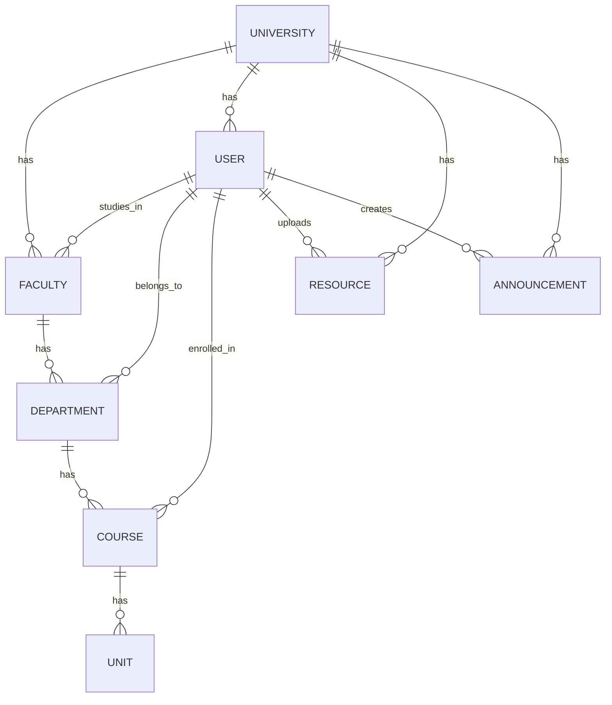

# Multi-University Architecture Plan for CampusHub

## Executive Summary

This document outlines the technical architecture for transforming CampusHub from a single-university platform to a multi-university SaaS platform. The existing codebase already has foundational multi-tenant administrative features that can be extended.

---

## Current State Analysis

### Existing Components

| Component | Status | Notes |
|-----------|--------|-------|
| **User Model** | Partial | Has `faculty`, `department`, `course` foreign keys |
| **Faculty/Department** | Implemented | Faculty → Department hierarchy exists |
| **MultiTenantAdminService** | Basic | Admin role hierarchy (Super Admin → Institution Admin → Faculty Admin → Department Admin) |
| **Resource Model** | Faculty-level | Links to Faculty, not University |

### Current Hierarchy
```
University (MISSING - needs to be added)
    └── Faculty (existing)
        └── Department (existing)
            └── Course (existing)
                └── Unit (existing)
```

---

## Architecture Options

### Option 1: Soft Multi-Tenancy (Recommended for CampusHub)
**Single database, logical separation via University field**

**Pros:**
- Lower cost (single infrastructure)
- Easier migration from current state
- Shared resources across universities
- Simpler maintenance

**Cons:**
- Data isolation relies on application logic
- Potential for cross-university data leaks if not careful

### Option 2: Hard Multi-Tenancy (Database-per-University)
**Separate database for each university**

**Pros:**
- Complete data isolation
- Custom configurations per university
- Easier compliance with university data policies

**Cons:**
- Higher infrastructure costs
- More complex deployment/maintenance
- Harder to share resources

---

## Implementation Plan (Option 1: Soft Multi-Tenancy)

### Phase 1: Data Model Extensions

#### 1.1 Create University Model
```python
# apps/universities/models.py
class University(TimeStampedModel):
    name = models.CharField(max_length=255)
    code = models.CharField(max_length=20, unique=True)
    slug = models.SlugField(unique=True)
    logo = models.ImageField(upload_to='universities/logos/')
    primary_color = models.CharField(max_length=7)  # HEX color
    secondary_color = models.CharField(max_length=7)
    domain = models.CharField(max_length=255)  # e.g., "campus.edu"
    is_active = models.BooleanField(default=True)
    is_verified = models.BooleanField(default=False)
    settings = models.JSONField(default=dict)  # Custom settings per university
    
    # Subscription/billing
    subscription_plan = models.CharField(max_length=50)
    subscription_expires = models.DateTimeField()
```

#### 1.2 Update Faculty Model
```python
# Add to Faculty model
university = models.ForeignKey(
    University, 
    on_delete=models.CASCADE, 
    related_name='faculties'
)
```

#### 1.3 Update User Model
```python
# Add to User model
university = models.ForeignKey(
    University,
    on_delete=models.PROTECT,
    related_name='users',
    null=True,  # Allow null for migration
    blank=True
)
```

#### 1.4 Update Resource Model
```python
# Add to Resource model (ensure university-level isolation)
university = models.ForeignKey(
    University,
    on_delete=models.CASCADE,
    related_name='resources'
)
```

### Phase 2: Backend Implementation

#### 2.1 University Service Layer
```python
# apps/universities/services.py
class UniversityService:
    @staticmethod
    def get_user_university(user):
        """Get university from user's faculty relationship"""
        if user.university:
            return user.university
        if user.faculty:
            return user.faculty.university
        return None
    
    @staticmethod
    def filter_by_university(queryset, user):
        """Filter queryset by user's university"""
        university = UniversityService.get_user_university(user)
        if not university:
            return queryset.none()
        return queryset.filter(university=university)
```

#### 2.2 Middleware for University Context
```python
# apps/core/middleware.py
class UniversityMiddleware:
    def __init__(self, get_response):
        self.get_response = get_response
    
    def __call__(self, request):
        # Extract university from:
        # 1. Subdomain (e.g., uniA.campushub.com)
        # 2. Header (X-University-ID)
        # 3. User's session
        
        request.university = self._resolve_university(request)
        return self.get_response(request)
```

#### 2.3 Update Admin Scopes
```python
# apps/admin_management/multitenant.py extensions
class UniversityAdminScope:
    # Add university-level filtering to all admin queries
    @staticmethod
    def filter_by_university_admin(user, queryset):
        university = UniversityService.get_user_university(user)
        if not university:
            return queryset.none()
        return queryset.filter(university=university)
```

### Phase 3: API Changes

#### 3.1 University Endpoints
```
GET    /api/v1/universities/           - List universities (public)
GET    /api/v1/universities/{slug}/    - Get university details
POST   /api/v1/universities/           - Create university (super admin)
PATCH  /api/v1/universities/{slug}/    - Update university
DELETE /api/v1/universities/{slug}/    - Deactivate university
```

#### 3.2 Updated Faculty Endpoints
```
GET    /api/v1/faculties/?university={slug}  - Filter by university
```

#### 3.3 Registration Flow
```
POST /api/v1/auth/register/
{
    "email": "student@uni.edu",
    "password": "...",
    "university_code": "UNI001"  # Auto-detect from email domain
}
```

### Phase 4: Frontend Changes

#### 4.1 University Selector
- Login page: Show university selector or auto-detect from email domain
- Settings: Allow users to see/change their university

#### 4.2 University Branding
```typescript
// mobile/src/services/themeService.ts
const getUniversityTheme = (university) => ({
    primaryColor: university.primary_color,
    secondaryColor: university.secondary_color,
    logo: university.logo_url
});
```

#### 4.3 Admin Dashboard Updates
- University management panel
- Cross-university analytics (super admin only)
- University-specific settings

### Phase 5: Data Migration

```python
# Migration script pseudo-code
for faculty in Faculty.objects.all():
    # Determine university from faculty name/code
    university, _ = University.objects.get_or_create(
        code=extract_university_code(faculty.code),
        defaults={
            'name': extract_university_name(faculty.name)
        }
    )
    faculty.university = university
    faculty.save()
    
    # Update related objects
    Resource.objects.filter(faculty=faculty).update(university=university)
    User.objects.filter(faculty=faculty).update(university=university)
```

---

## Data Models Overview



---

## Security Considerations

1. **Cross-University Data Isolation**
   - All queries must include university filter
   - Implement middleware to enforce isolation
   - Add database-level constraints

2. **Admin Access Control**
   - Super admins see all universities
   - University admins see only their institution
   - Faculty/Department admins see their scope only

3. **API Rate Limiting**
   - Per-university rate limits
   - Prevent one university from affecting others

---

## Implementation Priority

| Priority | Task | Estimated Effort |
|----------|------|------------------|
| P0 | Create University model & migrate data | 2 days |
| P0 | Add university foreign keys | 1 day |
| P0 | University middleware | 1 day |
| P1 | Update admin scopes | 2 days |
| P1 | University API endpoints | 2 days |
| P2 | Frontend university selector | 3 days |
| P2 | Theme/branding per university | 2 days |
| P3 | Cross-university sharing (optional) | 3 days |

---

## Backward Compatibility

- Existing single-university deployments will work with a default "Default University" created during migration
- Faculty/Department queries still work, just filtered by university
- No breaking changes to existing API contracts

---

## Student Registration Flow

### Multi-University Registration Options

There are **three ways** a student can be associated with a university during registration:

### Option 1: Email Domain Detection (Recommended)
The system auto-detects the university from the student's email domain.

```
# Registration Request
POST /api/v1/auth/register/
{
    "email": "student@uni.edu",
    "password": "...",
    "full_name": "John Doe",
    "registration_number": "UNI001/2024/001"
}

# Backend Logic:
1. Extract domain from email → "uni.edu"
2. Look up University by domain → University(id=1, name="University", domain="uni.edu")
3. Auto-assign university to user
4. If no university found → Return error "Email domain not recognized"
```

### Option 2: Explicit University Code
Student provides university code during registration.

```
# Registration Request
POST /api/v1/auth/register/
{
    "email": "student@gmail.com",  # Personal email
    "password": "...",
    "full_name": "John Doe",
    "registration_number": "UNI001/2024/001",
    "university_code": "UNI001"  # Explicit code
}
```

### Option 3: Admin-Created Accounts
University admins create student accounts manually.

```
# Admin creates student account
POST /api/v1/admin/users/
{
    "email": "student@uni.edu",
    "full_name": "John Doe",
    "registration_number": "UNI001/2024/001",
    "faculty": 1,
    "department": 2,
    "course": 3,
    "year_of_study": 1,
    "send_invite": true  # Sends invitation email
}
```

### Registration Validation Rules

```python
# Registration validation logic
def validate_registration(university, email, registration_number):
    # 1. University must exist and be active
    if not university or not university.is_active:
        raise ValidationError("University not found or inactive")
    
    # 2. Email domain must match university (if domain enforcement enabled)
    if university.settings.get('enforce_email_domain'):
        expected_domain = university.domain
        if not email.endswith(f"@{expected_domain}"):
            raise ValidationError(
                f"Email must be from @{expected_domain}"
            )
    
    # 3. Registration number must be unique within university
    if User.objects.filter(
        university=university,
        registration_number__iexact=registration_number
    ).exists():
        raise ValidationError(
            "Registration number already exists in this university"
        )
    
    return True
```

### Updated Registration Serializer

```python
class UserRegistrationSerializer(serializers.ModelSerializer):
    password = serializers.CharField(write_only=True)
    password_confirm = serializers.CharField(write_only=True)
    university_code = serializers.CharField(required=False)  # Optional
    
    class Meta:
        model = User
        fields = [
            "email",
            "password",
            "password_confirm",
            "full_name",
            "registration_number",
            "university_code",  # Added
            "faculty",
            "department",
            "course",
            "year_of_study",
        ]
    
    def validate(self, attrs):
        # Auto-detect university from email
        university = attrs.get('university')
        university_code = attrs.get('university_code')
        email = attrs.get('email', '')
        
        if university_code:
            university = University.objects.filter(
                code=university_code, 
                is_active=True
            ).first()
        else:
            # Auto-detect from email domain
            domain = email.split('@')[1] if '@' in email else ''
            university = University.objects.filter(
                domain=domain, 
                is_active=True
            ).first()
        
        if not university:
            raise ValidationError(
                "University not found. Please provide a valid university code "
                "or use your university email address."
            )
        
        attrs['university'] = university
        return attrs
    
    def create(self, validated_data):
        validated_data.pop('university_code', None)
        # University is now in validated_data
        return User.objects.create_user(**validated_data)
```

---

## University Admin Management

### Each University Has Its Own Admin Team

```
Super Admin (Platform Owner)
    └── University Admin (per university)
            ├── Faculty Admin (per faculty)
            │       └── Department Admin (per department)
            └── Moderators
```

### Creating University Admins

#### Method 1: Super Admin Creates University + Admin

```python
# Super admin creates university
POST /api/v1/universities/
{
    "name": "University of Science",
    "code": "SCIUNI",
    "slug": "sciuni",
    "domain": "sciuni.edu",
    "primary_color": "#0066CC",
    "subscription_plan": "premium"
}

# Then creates university admin
POST /api/v1/admin/users/
{
    "email": "admin@sciuni.edu",
    "full_name": "University Admin",
    "role": "ADMIN",
    "university": "SCIUNI",
    "admin_role": "institution_admin"
}
```

#### Method 2: Self-Signup with Approval

```python
# Admin registration request (limited)
POST /api/v1/auth/register-admin/
{
    "email": "admin@sciuni.edu",
    "password": "...",
    "full_name": "University Admin",
    "university_code": "SCIUNI",
    "requested_role": "institution_admin"
}
# Result: Created as pending, requires Super Admin approval
```

### University Admin Permissions

| Permission | Super Admin | University Admin | Faculty Admin | Dept Admin |
|------------|-------------|-----------------|--------------|------------|
| View all universities | ✅ | ❌ | ❌ | ❌ |
| Manage own university | ✅ | ✅ | ❌ | ❌ |
| Manage own faculty | ✅ | ✅ | ✅ | ❌ |
| Manage own department | ✅ | ✅ | ✅ | ✅ |
| View all users (uni) | ✅ | ✅ | ❌ | ❌ |
| View users (faculty) | ✅ | ✅ | ✅ | ❌ |
| Create resources | ✅ | ✅ | ✅ | ✅ |
| Moderate resources | ✅ | ✅ | ✅ | ✅ |
| View analytics (uni) | ✅ | ✅ | ❌ | ❌ |

### Admin Scope Service Extension

```python
# apps/admin_management/multitenant.py
class UniversityAdminPermissions:
    """Permissions for university-level admins."""
    
    @staticmethod
    def can_manage_university(user, university):
        """Check if user can manage a specific university."""
        if user.is_superuser:
            return True
        if user.admin_role == AdminRole.INSTITUTION_ADMIN:
            return user.university_id == university.id
        return False
    
    @staticmethod
    def get_accessible_faculties(user):
        """Get list of faculties user can access."""
        if user.is_superuser:
            return Faculty.objects.all()
        if hasattr(user, 'university'):
            return Faculty.objects.filter(university=user.university)
        if hasattr(user, 'faculty'):
            return Faculty.objects.filter(id=user.faculty.id)
        return Faculty.objects.none()
```

---

## Alternative: Subdomain-Based Routing

For a more SaaS-like experience:

```python
# Subdomain routing example
# uniA.campushub.com → University A
# uniB.campushub.com → University B

SUBDOMAIN_PATTERN = re.compile(r'^([a-z0-9-]+)\.campushub\.com$')

def get_university_from_host(host):
    match = SUBDOMAIN_PATTERN.match(host)
    if match:
        slug = match.group(1)
        return University.objects.filter(slug=slug, is_active=True).first()
    return None
```
